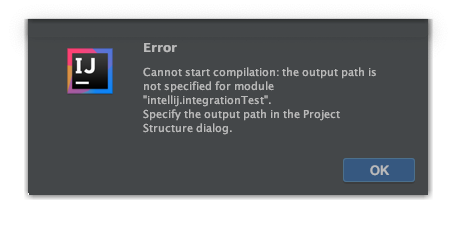

Simple reproduction of a bug in either IntelliJ or [Gradle Test Sets Plugin](https://github.com/unbroken-dome/gradle-testsets-plugin).

Open the project in IntelliJ and use it's gradle import function. Then run `Build -> Build Project` to compile the project.
IntelliJ will display an error message like:


If you edit `build.gradle` and comment out the line:

```errorprone("com.google.errorprone:error_prone_core:2.3.3"``` 

The error will no longer occur (but errorprone won't work properly either).